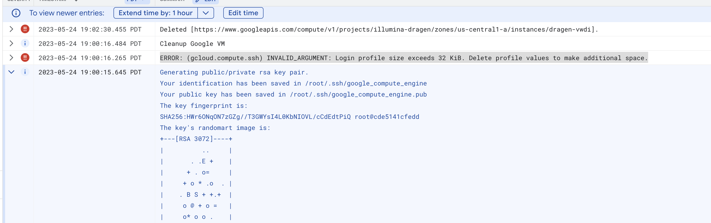

- [Introduction](#introduction)
- [Create GCP Environment for DRAGEN](#create-gcp-environment-for-dragen)
  * [Pre-requisites](#pre-requisites)
  * [GCP Infrastructure](#gcp-infrastructure)
- [Trigger the pipeline](#trigger-the-pipeline)
  * [Directly from GCS](#directly-from-gcs)
  * [From shell](#from-shell)
- [Configuration](#configuration)
- [References](#references)


## Introduction

This is a solution using GCP Cloud Storage -> Pub/Sub -> Cloud Function -> Batch API to trigger execution of the Dragen Software on FPGA dedicated hardware.

It offers a simplified user experience:
* Easy provisioning of the infrastructure,
* Easy way to trigger pipeline execution, by dropping an empty file called START_PIPELINE into the Cloud Storage bucket with required configuration data.


## Pre-requisites

### License Information
Following licenses and keys are required to operate this solution:
* Illumina
> Obtain a DRAGEN license key from Illumina.
* Atos
> Obtain a JARVICE username and API key from  Atos/Nimbix.  
> If you do not have a JARVICE username and API key for the Atos FPGA Acceleration for Illumina DRAGEN Bio-IT Platform solution, please contact support@nimbix.net.


### Infrastructure Preparation

In case you do not have org level admin access to modify Policy Constraints, make sure the following policies are disabled for your GCP project or request your admin to do so.
If you have Org Level admin access, this could be done programmatically when setting up the system:

| Policy Name                          |  Constraint Name     |  Effective Polciy   |
|--------------------------------------|-----|-----|
| Disable service account creation     |  constraints/iam.disableServiceAccountCreation   |  Not Enforced    |
| Disable service account key creation |   constraints/iam.disableServiceAccountKeyCreation  |  Not Enforced    |
| Allow list for External IP address   |    constraints/compute.vmExternalIpAccess  |  Not Enforced    |
| Require ShieldedVm                                      |   constraints/compute.requireShieldedVm   | Not Enforced     |
| Restrict authentication types                                    |  constraints/storage.restrictAuthTypes   |  Not Enforced    |

For `Restrict authentication types` - either should AllowAll or following projects need to be added:

- `projects/illumina-dragen`
- `projects/atos-illumina-public`
- `projects/batch-custom-image`


Following Google APIs need to be enabled (in case you do not have admin level access and this need to be requested separately. Otherwise, step could be skipped):

- The follow APIs will be used:
  * orgpolicy.googleapis.com
  * compute.googleapis.com
  * pubsub.googleapis.com
  * batch.googleapis.com
  * cloudresourcemanager.googleapis.com
  * secretmanager.googleapis.com
  * logging.googleapis.com
  * storage.googleapis.com
  * cloudfunctions.googleapis.com
  * cloudbuild.googleapis.com
  * cloudresourcemanager.googleapis.com
  * bigquery.googleapis.com
  * iam.googleapis.com

## GCP Setup

* Create GCP Project with assigned project account
* Open Cloud Shell and set env variable accordingly:
  ```shell
  export PROJECT_ID=
  ```

* Point to the Cloud Storage Bucket containing Samples Data (leave it out, if you have not setup yet, it will create default bucket `$PROJECT_ID-data`):
  ```shell
  export DATA_BUCKET_NAME=
  ```
* Use your Dragen license from Illumina (`ILLUMINA_LICENSE`), JARVICE username (`JXE_USERNAME`) and api key (`JXE_APIKEY`)to set env variables (to be used during the deployment)
  ```shell
  export ILLUMINA_LICENSE=
  export JXE_APIKEY=
  export JXE_USERNAME=
  ```
  
* At this point you either have manually followed the pre-requisites to disable policy constraints, or you have org level admin rights  and this could be done for you, when following variable is set: 

```shell
export DISABLE_POLICY=true
```

* Run following command to provision required infrastructure (Org policies, VPC, GCP Buckets, HMAC keys):
  ```shell
  ./setup.sh
  ```
> Command will take ~ 8 minutes and you should see following message at the end of the execution: ` "Success! Infrastructure deployed and ready!"` with next steps described.
 
This command executes following steps:
* Enables required APIs
* Sets required constraints
* Creates Network/Subnet and required Firewall rules
* Creates GCS Bucket for input and output
* Creates HMAC keys (stores as GCP secrets)
* Creates Secrets with License keys (stores as GCP secrets)
* Creates Service Account with required permissions to run the Batch Job
* Uploads sample config files  with batch, Jarvice and Dragen options
* Deploys Cloud Function - to trigger batch Job on GCS event

## Configuration
There are sample configuration files generated to inspect:
* $PROJECT_ID-trigger/cram/403/batch_config.json  - to Run cram jobs using 4.03 version
  * References `gs://$PROJECT_ID-config/cram_config_403.json` config
* $PROJECT_ID-trigger/cram/378/batch_config.json  - to Run cram jobs using 3.78 version
  * References `gs://$PROJECT_ID-config/cram_config_378.json` config
* $PROJECT_ID-trigger/fastq/batch_config.json     - to Run fastq job using 4.03 version
  * References `gs://$PROJECT_ID-config/fastq_config.json` config

Batch configuration file  (batch_config.json) describes amount of jobs to be run in parallel.

Note (based on the suer requirements):
* ORA files in the same directory - are combined in a single command.
* Each CRAM file - is a separate command.

## Trigger the pipeline
To trigger the pipeline you need to have either `batch_config.json` file  or `jobs.csv` in the GCS directory inside `$PROJECT_ID-trigger` bucket.

`jobs.csv` file is in the csv format listing jobs to run, each of them having `batch_config.json` file associated.

For example:
```shell
job1, gs://bucket-name/batch_config1.json
job2, gs://bucket-name/batch_config2.json
job3, gs://bucket-name/batch_config3.json
```

Drop empty file named  `START_PIPELINE` (see  `cloud_functions/run_batch/START_PIPELINE`)  into the folder as described above.
> Must be inside `gs://${PROJECT_ID}-trigger` bucket, since it is configured to listen to the Pub/Sub Cloud Storage event.

Sample scripts to trigger for execution (to be run from the Cloud Shell):

* ./run_cram_403.sh - to trigger 4.03 execution of cram jobs (using `$PROJECT_ID-trigger/cram_test/403/batch_config.json`)
* ./run_fastq_403.sh - to trigger fastq 4.03 execution (using `$PROJECT_ID-trigger/fastq_test/batch_config.json`)
* ./run_cram_378.sh - to trigger 3.78 execution for cram sample (using `$PROJECT_ID-trigger/cram_test/378/batch_config.json`)

## Cloud Functions
There are three Cloud Functions: `run_dragen_job`, `get_status` and `job_scheduler`.

`run_dragen_job` - Uses [Array Jobs](https://hpc-unibe-ch.github.io/slurm/array-jobs.html) and Batch API to 
submit Batch Jobs with tasks to run Dragen Software based on the provided configuration and samples list.
Is triggered when `START_PIPELINE` file is uploaded into the GCS `$PROJECT_ID-trigger` bucket and following logic is performed:
* Checks for the `jobs.csv` file inside the trigger directory and triggers the first job in the list by uploading `START_PIEPLEINE` file inside the directory with the job configuration file.
  * For example, in case the `jobs.csv` file looks like below:
   ```shell
    job1, gs://$PROJECT_ID-trigger/mytest/batch_config1.json
    job2, gs://$PROJECT_ID-trigger/mytest/batch_config2.json
    job3, gs://$PROJECT_ID-trigger/mytest/batch_config3.json
  ```
  * `START_PIPLEINE` to trigger first job will look like below and be uploaded into `gs://$PROJECT_ID-trigger/mytest`
  * Copies `jobs.csv` into the `gs://$PROJECT_ID-trigger/scheduler/jobs.csv` directory.
  * It is important to realize, that only One Schedule could be used at a time. It is also due to the hardware constrains and that there should be only one job (which might have multiple tasks) be running at a time.
```shell
{
  "dragen-job": "job1",
  "config": "batch_config1.json"
}
```
* If `jobs.csv` file was not detected, parses the content of the `START_PIPELINE` file: 
  * In case if `START_PIPELINE` file is empty, for the configuration uses `batch_config.json` file name.
  * Otherwise, tries to parse `START_PIPLEINE` as json and extracts `config` (as a name to be used instead of the default `batch_config.json`) and `dragen-job` (to be used a Job label) parameters.
  * Looks for the `batch_config.json` or for the name as specified under `config` in `START_PIPELINE` inside the triggered directory.
  * Calls batch API and passes information as specified in the detected configuration file. 
  * Saves information about CREATED tasks into the BigQuery `$PROJECT_ID.dragen_illumina.tasks_status` table.
  * generates `gs://$PROJECT_ID-output/jobs_created/<job_id>.csv` with all tasks information for further reference and usage by the `get_status` Cloud Function.

<br>

`get_status` - Streams information about Task State Changes into the BigQuery.
* is subscribed to the `Topic: job-dragen-task-state-change-topic` and saves information about the task (plus combines with information from the `job_id.csv`) into the BigQuery.

* Receives Pub/Sub notification about Batch Task State Change (with `JobUID`,`NewTaskState`, `TaskUID`) using `job-dragen-task-state-change-topic` topic.
* Using JobUID/TaskUID tries to get additional task information from the `gs://$PROJECT_ID-output/jobs_created/<job_id>.csv` (Can also parse Log file generated by the task when csv file is not detected)   
* Saves information about the task Status and task additional information for the reference inside the BigQuery `$PROJECT_ID.dragen_illumina.tasks_status` table.

tries to get <job_id>.csv file and get additional information about task (which samples, input_path, output_path). 

<br>

`job_scheduler` - Schedules next Job using `jobs.csv` file when receives notification on the Successfully completion of the previous job in the list.
* Receives Pub/Sub notification about batch Job State Change (with `JobUID`,`NewJobState`, `JobName`) using `job-dragen-job-state-change-topic` topic.
* Using JobUID and job label checks for `gs://$PROJECT_ID-trigger/scheduler/jobs.csv` file to determine which job to be executed next.
* Drops `START_PIPELINE` file into the directory containing batch configuration of the job.
  * For example, if Pub/Sub contains information of the NewJobState='SUCCEEDED' and the label of the job is 'job1' based on the following `jobs.csv` file, next job to be triggered is job2: 
   ```shell
    job1, gs://$PROJECT_ID-trigger/mytest/batch_config1.json
    job2, gs://$PROJECT_ID-trigger/mytest/batch_config2.json
    job3, gs://$PROJECT_ID-trigger/mytest/batch_config3.json
  ```
  * `START_PIPLEINE` looking like below to be uploaded into the   `gs://$PROJECT_ID-trigger/mytest` directory

  ```shell
  {
    "dragen-job": "job2",
    "config": "batch_config2.json"
  }
  ```


## Demo Flows

###  Sample Dry Run

To trigger the Job, run following command:
```shell
./run_cram_378_dry_run.sh
```

Check if the Batch Job was scheduled successfully by navigating to [Batch Lists](https://console.cloud.google.com/batch/jobs).
  - Job should appear as Scheduled and should have two tasks.
  - After few minutes Job should get into Running status and then appear as Succeeded.

Check the BigQuery Table by navigate to [BigQuery](https://console.cloud.google.com/bigquery) and opening up  `$PROJECT_ID.dragen_illumina.tasks_status` table => Preview.

Following sample queries are available via scripts:

- Summary of the samples with counts per status:
  ```shell
  sql-scripts/run_query.sh count
  ```

Output:
```shell
+-------+---------+-----------+--------+
| TOTAL | RUNNING | SUCCEEDED | FAILED |
+-------+---------+-----------+--------+
|     2 |       0 |         2 |      0 |
+-------+---------+-----------+--------+
```

- Detailed summary of samples with the latest statuses:
```shell
sql-scripts/run_query.sh samples
```

Output:
```shell
+-------------------------------------------------+-----------+-----------+----------------------------------------+----------------------------------------------------------------------+---------------------+
|                     task_id                     | sample_id |  status   |       input_path       |                        output_path                   |      timestamp      |
+-------------------------------------------------+-----------+-----------+----------------------------------------+----------------------------------------------------------------------+---------------------+
| job-dragen-a2dfc32-6180da5b-5c9b-4a470-group0-0 | NA0       | SUCCEEDED | s3://data/NA0/NA0.cram | s3://output/3_78/aggregation/NA0/2023-08-26-02-03-07 | 2023-08-26T02:05:31 |
| job-dragen-a2dfc32-6180da5b-5c9b-4a470-group0-1 | NA1       | SUCCEEDED | s3://data/NA1/NA1.cram | s3://output/3_78/aggregation/NA1/2023-08-26-02-03-07 | 2023-08-26T02:05:32 |
+-------------------------------------------------+-----------+-----------+----------------------------------------+----------------------------------------------------------------------+---------------------+
```

- Detailed info per sample:
```shell
sql-scripts/run_query.sh sample NA1
```

Output:
```shell
+----------------------------------------+-----------+-------------------------------------------------+-----------+----------------------------------------+----------------------------------------------------------------------+---------------------+
|                 job_id                 | job_label |                     task_id                     |  status   |        input_path      |                         output_path                  |      timestamp      |
+----------------------------------------+-----------+-------------------------------------------------+-----------+----------------------------------------+----------------------------------------------------------------------+---------------------+
| job-dragen-a2dfc32-6180da5b-5c9b-4a470 |           |                                                 | SCHEDULED | s3://data/NA1/NA1.cram | s3://output/3_78/aggregation/NA1/2023-08-26-02-03-07 | 2023-08-26T02:03:09 |
| job-dragen-a2dfc32-6180da5b-5c9b-4a470 |           | job-dragen-a2dfc32-6180da5b-5c9b-4a470-group0-1 | RUNNING   | s3://data/NA1/NA1.cram | s3://output/3_78/aggregation/NA1/2023-08-26-02-03-07 | 2023-08-26T02:04:44 |
| job-dragen-a2dfc32-6180da5b-5c9b-4a470 |           | job-dragen-a2dfc32-6180da5b-5c9b-4a470-group0-1 | SUCCEEDED | s3://data/NA1/NA1.cram | s3://output/3_78/aggregation/NA1/2023-08-26-02-03-07 | 2023-08-26T02:05:32 |
+----------------------------------------+-----------+-------------------------------------------------+-----------+----------------------------------------+----------------------------------------------------------------------+---------------------+
```


### 3.7.8 CRAM Smoke Test
This job executes a Smoke Test using 3.7.8 Dragen software version on a CRAM sample.

#### Check Configuration used for the Job
Using GCP Cloud Console, go to the Cloud Storage `$PROJECT_ID-trigger` bucket and navigate to `cram/378` folder.
This folder contains `batch_config.json` file, which specifies:
- how to run the batch Job using `run_options`,
- input type - `cram` | `fastq` | `fastq_list` (`input_type`)
- input file to load for sample names and sample locations (`input_list`)
- config file to load with Dragen software version and dragen parameters to pass (`config`)
- 
Manually inspect `batch_config.json` and `cram_config_378.json` and `NA12878_batch.txt` files.

#### Trigger the Pipeline
Run following commands in the Cloud Shell:


This will drop an empty `START_PIPELINE` file into the `$PROJECT_ID-trigger/cram/378` folder.

#### Check the Job been submitted
* Using GCP Console go to [Batch](https://console.cloud.google.com/batch/jobs), you will see new `job-dragen-xxxx` in the Scheduled Status.
* Select the newly created job in the `Job name` column.
* In the task details check for the `Inline command` - these a re options passed to jarvice and dragen
* Switch from the `Details` tab to `Events` tab of the Job.
* Select `Logging` - this opens up Logging collected from the VM running Dragen software

Alternative way to list job is to run following command in the Cloud Shell (substitute JOB_NAME accordingly):
> This would not truncate the inline command as it is happening in the UI
```shell
gcloud batch jobs describe --location us-central1 JOB_NAME
```

#### Check Big Query Table for the Task Status
Navigate to BigQuery using Cloud Console and check for the `$PROJECT_ID.dragen_illumina.tasks_status` table.

Following events for the processing tasks are recorded along with the information about `sample_id`, `command`, `input_path`, `output_path`:
- When task is initially created (Job Submitted)
- When the task got into the 'RUNNING' state
- When the task is completed (either `FAILED` or `SUCCEEDED` state)

```shell
sql-scripts/run_query.sh sample NA12878-SmokeTest
```

Sample Output:
```shell
+----------------------------------------+-----------+-------------------------------------------------+-----------+---------------------------------------------------+----------------------------------------------------------------------------------+---------------------+
|                 job_id                 | job_label |                     task_id                     |  status   |                input_path      |                                  output_path                       |      timestamp      |
+----------------------------------------+-----------+-------------------------------------------------+-----------+---------------------------------------------------+----------------------------------------------------------------------------------+---------------------+
| job-dragen-910d240-26452221-7d34-47f30 |           |                                                 | SCHEDULED | s3://demo/NA12878/NA12878.cram | s3://output/3_78/aggregation/NA12878-SmokeTest/2023-08-25-19-52-41 | 2023-08-25T19:52:42 |
| job-dragen-910d240-26452221-7d34-47f30 |           | job-dragen-910d240-26452221-7d34-47f30-group0-0 | RUNNING   | s3://demo/NA12878/NA12878.cram | s3://output/3_78/aggregation/NA12878-SmokeTest/2023-08-25-19-52-41 | 2023-08-25T19:55:21 |
+----------------------------------------+-----------+-------------------------------------------------+-----------+---------------------------------------------------+----------------------------------------------------------------------------------+---------------------+

```
#### Check Job completion
This job will take ~ 1 hour to complete. 

### Dry Run for 100 Tasks
During the setup, a test file with 100 test samples has been generated and uploaded to `gs://$PROJECT_ID-trigger/cram/input_list/100_samples.txt`

> To (re-)generate a samples list file for testing, you can run following command:
>```shell
>utils/create_input_list.sh -c <COUNT> -o <GCS_URI>
>```
> Example of 1000 samples:
>
>```shell
>utils/create_input_list.sh -c 1000 -o gs://$PROJECT_ID-trigger/test/1000_samples.txt
>```

Now we want to prepare required configuration files and list of jobs to execute, so we would do with the real samples list. For that we need to: 
1. Split input file into chunks based on the count of samples we want to run in a single batch job (that would run in parallel until completion)
2. Select configuration we want to run it against (Dragen Software Version, Dragen options)
3. Generate a list of jobs that would be handled by the scheduler.

Following wrapper script will split 100 test samples into 5 Jobs, with 20 Tasks each and 10 tasks to be run in parallel.

Run following command to get required configuration/setup files generated:
```shell
utils/prepare_input.sh
```

Output:

```shell
....
Done! Generated: 
 - Batch configurations inside gs://$PROJECT_ID-trigger/test/jobs
 - Chunked samples lists inside gs://$PROJECT_ID-trigger/test/input_list
 - Jobs list file gs://$PROJECT_ID-trigger/test/jobs.csv

```

> Alternatively, you can use utility  by  providing input parameters directly:
> NB! Make sure **NOT to forget** to use _dryrun_ option (--dryrun) when not intending for the actual execution due to the costs involved.
> ```shell
> python utils/prepare_input/main.py -h
> ```


Trigger the pipeline: 
```shell
./run_test_jobs.sh
```

- The wrapper script above is dropping `START_PIPELINE` file into the `gs://$PROJECT_ID-trigger/test` directory.
- `run_dragen_job` Cloud Function detects `jobs.csv` file in there and schedules processing of the jobs, by starting first job in the list and copying csv file into the `gs://$PROJECT_ID-trigger/scheduler/` directory. 

Using GCP Console, go to the Batch list and wait for the first job to get Running (from the Queued to Scheduled to Running Status).

Run following query to see data in the BigQuery:

```shell
sql-scripts/run_query.sh count
```

Sample Output:
```shell
+-------+---------+-----------+--------+
| TOTAL | RUNNING | SUCCEEDED | FAILED |
+-------+---------+-----------+--------+
|   10  |      10 |       0   |      0 |
+-------+---------+-----------+--------+

```

It will take around 1 minute for first 10 tasks completed and next 10 tasks to be scheduled by the Batch.

```shell
+-------+---------+-----------+--------+
| TOTAL | RUNNING | SUCCEEDED | FAILED |
+-------+---------+-----------+--------+
|    40 |       10 |       10 |     0 |
+-------+---------+-----------+--------+
```

When first Job with all 20 tasks is completed, Cloud Function `job_scheduler` will schedule the next job, and new Job will appear in the Batch Job List.


To list overview of the sample per status:
```shell
sql-scripts/run_query.sh samples
```

```shell
+--------------------------------------------------+-----------+-----------+-----------------------------------------------+----------------------------------------------------------------------+---------------------+
|                     task_id                      | sample_id |  status   |       input_path           |                             output_path                |      timestamp      |
+--------------------------------------------------+-----------+-----------+-----------------------------------------------+----------------------------------------------------------------------+---------------------+
| job-dragen-7781e83-9806b982-eecc-4c880-group0-11 | NA11      | RUNNING   | s3://demo/NA11/NA11.cram   | s3://output/3_78/aggregation/NA11/2023-08-25-22-55-04  | 2023-08-25T22:57:55 |
| job-dragen-7781e83-9806b982-eecc-4c880-group0-12 | NA12      | RUNNING   | s3://demo/NA12/NA12.cram   | s3://output/3_78/aggregation/NA12/2023-08-25-22-55-04 ~~~~ | 2023-08-25T22:57:56 |
...
| job-dragen-8ea240c-55762f35-c132-4de80-group0-4  | NA4       | SUCCEEDED | s3://demo/NA4/NA4.cram     | s3://output/3_78/aggregation/NA4/2023-08-25-22-06-45   | 2023-08-25T22:09:15 |
| job-dragen-8ea240c-55762f35-c132-4de80-group0-5  | NA5       | SUCCEEDED | s3://demo/NA5/NA5.cram     | s3://output/3_78/aggregation/NA5/2023-08-25-22-06-45   | 2023-08-25T22:09:15 |
```

To see details about a sample:
```shell
sql-scripts/run_query.sh sample NA4
```

```shell
+----------------------------------------+-----------+-------------------------------------------------+-----------+-------------------------------------------+--------------------------------------------------------------------+---------------------+
|                 job_id                 | job_label |                     task_id                     |  status   |    input_path          |                            output_path               |      timestamp      |
+----------------------------------------+-----------+-------------------------------------------------+-----------+-------------------------------------------+--------------------------------------------------------------------+---------------------+
| job-dragen-c791f80-45080cd2-0aed-46f40 | job0      |                                                 | SCHEDULED | s3://demo/NA4/NA4.cram | s3://output/3_78/aggregation/NA4/2023-08-25-22-23-04 | 2023-08-25T22:23:05 |
| job-dragen-c791f80-45080cd2-0aed-46f40 | job0      | job-dragen-c791f80-45080cd2-0aed-46f40-group0-4 | RUNNING   | s3://demo/NA4/NA4.cram | s3://output/3_78/aggregation/NA4/2023-08-25-22-23-04 | 2023-08-25T22:24:38 |
| job-dragen-c791f80-45080cd2-0aed-46f40 | job0      | job-dragen-c791f80-45080cd2-0aed-46f40-group0-4 | SUCCEEDED | s3://demo/NA4/NA4.cram | s3://output/3_78/aggregation/NA4/2023-08-25-22-23-04 | 2023-08-25T22:25:27 |
+----------------------------------------+-----------+-------------------------------------------------+-----------+-------------------------------------------+--------------------------------------------------------------------+---------------------+

```
## Troubleshooting

### Exhausting ssh login profile
#### Error
```shell
ERROR: (gcloud.compute.ssh) INVALID_ARGUMENT: Login profile size exceeds 32 KiB. Delete profile values to make additional space.
```

#### Resolution

Clean up service account ssh keys:

```shell
./utils/cleanup_keys.sh
```

The command above will activate service account and clean up its keys.


## Supported versions

Following dragen `VERSION`(s) are supported:
```shell
 "jarvice_options": {
        "entrypoint": "/bin/bash",
        "jxe_app": "VERSION",
        "image_uri": "us-docker.pkg.dev/jarvice/images/illumina-dragen:v1.2-rc"
    }
```

**3.10.4** version of DRAGEN:
* "illumina-dragen_3_10_4n"

**3.7.8** version:
* "illumina-dragen_3_7_8n"


**4.0.3** version of DRAGEN
* "illumina-dragen_4_0_3n"


## References
* Sample data downloaded from  [Google Drive DRAGEN_data](https://drive.google.com/corp/drive/folders/1nwewtQCu2KarG-zw_pv4XZhwS8XOc2lo).

* The following [README file](https://docs.google.com/document/d/1Uawxi4UrY_jjsD6Mp-n1o-_gMUB6eSMA5vIWdhVHS3U/edit#heading=h.z1g5ff2ylnea) was used as original input.

## Loading batch Job details

```shell
gcloud batch jobs describe --location us-central1 $JOB_NAME 
```


## Sharing Code with the Customer

Configure the repo access control so customer can view or download it:
* Go to [cloud-ce-shared-csr project](https://source.cloud.google.com/cloud-ce-shared-csr?project=cloud-ce-shared-cs) in Cloud Source Repos
* Select [this repository](https://source.cloud.google.com/cloud-ce-shared-csr/evekhm-broad-dragen)
* Select the settings icon  (top right)
* Select Permissions
* In the Members box, add one or more customer's email address (They need to have a google account)
* Set Role to: Source repository-->Source Repository Reader
* Click Add

Your Customer can now clone the repository in their own environment. Provide the following instructions to the customer:
* Install the [Google Cloud SDK](https://cloud.google.com/sdk)
* Authenticate the SDK with their Google credentials

```shell
gcloud init
```

* Clone the repository (replace USERNAME-project-name with your repo name)
```shell
gcloud source repos clone evekhm-broad-dragen --project=cloud-ce-shared-csr
cd evekhm-broad-dragen
git checkout main
```
