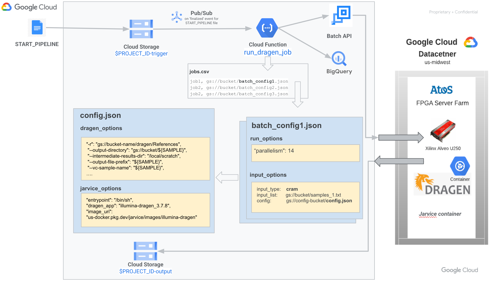
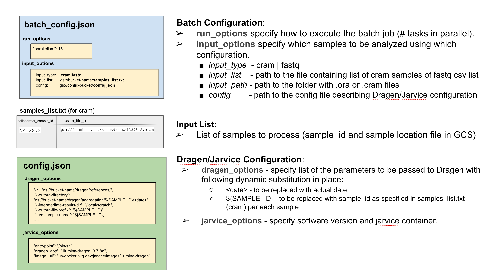

<!-- TOC -->
  * [Introduction](#introduction)
    * [Slides](#slides)
    * [Overview](#overview)
  * [Pre-requisites](#pre-requisites)
    * [License](#license)
    * [Used APIs](#used-apis)
  * [Infrastructure Setup](#infrastructure-setup)
    * [Google Cloud Project Setup](#google-cloud-project-setup)
    * [Modify Org Policy Constraints](#modify-org-policy-constraints)
    * [Quick Start - Setup All](#quick-start---setup-all)
    * [Step-by-Step Guide](#step-by-step-guide)
      * [Setup Terraform](#setup-terraform)
      * [Init and Apply Terraform](#init-and-apply-terraform)
      * [Deploy Cloud Functions and Python Package](#deploy-cloud-functions-and-python-package)
  * [Test Data](#test-data)
  * [Demo Flows](#demo-flows)
    * [Smoke Test](#smoke-test)
      * [Trigger the Pipeline](#trigger-the-pipeline)
      * [Check the Job status](#check-the-job-status)
      * [Check Configuration](#check-configuration)
      * [Check the Big Query Table](#check-the-big-query-table)
      * [Check the Job completion](#check-the-job-completion)
    * [Dry Run - Job with a single processing task](#dry-run---job-with-a-single-processing-task)
    * [Dry Run - a list of Jobs](#dry-run---a-list-of-jobs)
    * [Dry Run - for 100 Tasks -> Chunk into Jobs](#dry-run---for-100-tasks----chunk-into-jobs)
  * [Cloud Functions](#cloud-functions)
    * [run_dragen_job](#rundragenjob)
    * [get_status](#getstatus)
    * [job_scheduler](#jobscheduler)
  * [Pipeline flow](#pipeline-flow)
  * [Supported DRAGEN versions](#supported-dragen-versions)
  * [References](#references)
  * [Loading batch Job details](#loading-batch-job-details)
<!-- TOC -->
## Introduction

This is a solution using GCP Cloud Storage -> Pub/Sub -> Cloud Function -> Batch API to trigger execution of the Dragen Software on FPGA dedicated hardware.
It is built around implementation of the  [Illumina DRAGEN batch engine](https://github.com/nimbix/jarvice-dragen-batch/blob/maste).

Offers a simplified user experience with enhanced features sucha as:
- Easy provisioning of the whole infrastructure (using Terraform and Cloud Build),
- Easy way to trigger pipeline execution, by dropping an empty file called START_PIPELINE into the Cloud Storage bucket with required configuration data.
- Possibility to schedule execution of thousands of samples and define how many of them should be executed in parallel (using GCP Batch).
- Easy way to configure and customize job execution (setting up DRAGEN software version and other DRAGEN run  parameters).
- Monitoring tools for the sample processing progress using BigQuery (an overview of the completed tasks with completion statuses).
- Notifications on Batch Job and Task status changes.

### Slides

[Presentation August 30th, 2023](https://docs.google.com/presentation/d/1I4iUiCN3pxrgNIgWKfd0qwdNycB6UNHnDDs5EvAvU5w/edit?usp=sharing&resourcekey=0-ItVg8sU99RJBufH9Xn4O_g)

### Overview





  
## Pre-requisites

### License

Following licenses and keys are required to operate this solution:

- Illumina: Obtain a DRAGEN license key from Illumina.
- JARVICE: Obtain a JARVICE username and API key from Eviden/Nimbix.
  > If you do not have a JARVICE username and API key for the Atos FPGA Acceleration for Illumina DRAGEN Bio-IT Platform solution, please contact support@nimbix.net.
  

### Used APIs
Following Google APIs will be used by the Project:

- The follow APIs will be used:
    #### Part of Preparation Steps
    - orgpolicy.googleapis.com
    - iamcredentials.googleapis.com
    - serviceusage.googleapis.com
    - cloudresourcemanager.googleapis.com
    - iam.googleapis.com
    #### Done Via Terraform
    - pubsub.googleapis.com
    - artifactregistry.googleapis.com
    - bigquery.googleapis.com
    - cloudbuild.googleapis.com
    - compute.googleapis.com
    - cloudresourcemanager.googleapis.com
    - iam.googleapis.com
    - logging.googleapis.com
    - batch.googleapis.com
    - secretmanager.googleapis.com
    - cloudfunctions.googleapis.com
    - storage.googleapis.com


## Infrastructure Setup

### Google Cloud Project Setup

> It is recommended to start with a brand new Google Cloud project to have a clean start.

- Create GCP Project with attached Billing Account
- Clone this Repository using Cloud Shell:
```shell
git clone git@github.com:evekhm/illumnia.git  
cd illumnia
```

[//]: # (```shell)

[//]: # (gcloud source repos clone evekhm-broad-dragen --project=cloud-ce-shared-csr)

[//]: # (cd evekhm-broad-dragen)

[//]: # (git checkout main)

[//]: # (```)

Run the following commands:

```shell
export PROJECT_ID=
gcloud config set project "${PROJECT_ID}" --quiet
```

[//]: # (```shell)

[//]: # (gcloud config set project "${PROJECT_ID}" --quiet)

[//]: # (gcloud services enable cloudresourcemanager.googleapis.com)

[//]: # ()
[//]: # (# for Terraform to able to run gcloud with correct config.)

[//]: # (gcloud auth login)

[//]: # (gcloud auth application-default login )

[//]: # (gcloud auth application-default set-quota-project $PROJECT_ID)

[//]: # (```)

Use your Dragen license from Illumina (`ILLUMINA_LICENSE`), JARVICE username (`JXE_USERNAME`) and api key (`JXE_APIKEY`):
> ILLUMINA_LICENSE should be in the format: _https://YOUR_LICENSE_SECRET_KEY@license.edicogenome.com_

```shell
  export ILLUMINA_LICENSE=
  export JXE_APIKEY=
  export JXE_USERNAME=
```


### Modify Org Policy Constraints

Following organization policies need to be modified:

| Policy Name                          | Constraint Name                                  | Effective Polciy |
| ------------------------------------ | ------------------------------------------------ | ---------------- |
| Disable service account creation     | constraints/iam.disableServiceAccountCreation    | Not Enforced     |
| Disable service account key creation | constraints/iam.disableServiceAccountKeyCreation | Not Enforced     |
| Allow list for External IP address   | constraints/compute.vmExternalIpAccess           | Not Enforced     |
| Require ShieldedVm                   | constraints/compute.requireShieldedVm            | Not Enforced     |
| Restrict authentication types        | constraints/storage.restrictAuthTypes            | Not Enforced     |
| Allow trusted images | constraints/compute.trustedImageProjects| Not Enforced|

Also, you need to either set `AllowAll` for `Allow trusted images` constraint (`constraints/compute.
trustedImageProjects`) or add following projects to the Allowed list:

- `projects/illumina-dragen`
- `projects/atos-illumina-public`
- `projects/batch-custom-image`


For updating all of the above organization policies you will need to have organization level admin rights.
Updating could be done either:
- Manually via [GCP Console](https://console.cloud.google.com/iam-admin/orgpolicies) or
- By running the following script (you will need to have organization level Admin rights):

    ```shell
    bash setup/update_gcp_org_policies.sh
    ```
- Or as an option `-d` when following Quick Start method described below.

### Quick Start - Setup All
As a quick start, you could run the follow script to do all the installations:

```shell
bash setup/setup_all.sh [-a] [-d]
```

Options:
```text
-a - Auto-Approves Terraform Apply State Changes (by default - requires user confirmation)
-d - Disables required organization policies  (by default - skips this step)
```

### Step-by-Step Guide

Alternatively, you could do everything step by step by running following scripts.

#### Setup Terraform

```shell
bash setup/setup_terraform.sh
```

#### Init and Apply Terraform


```shell
bash setup/init_foundation.sh
```

#### Deploy Cloud Functions and Python Package

```shell
bash setup/deploy.sh
```

## Test Data

For the 3.7.8 CRAM SMoke Test, you will need Samples Data (~90GiB).

For the Broad (Requires access storage viewer access for the [GCS bucket](https://pantheon.corp.google.com/storage/browser/broad-gp-dragen-demo)):

```shell
  export SRC_DATA_BUCKET_NAME=broad-gp-dragen-demo
```
```shell
  export DATA_BUCKET_NAME=$PROJECT_ID-data
  gsutil -m cp -r gs://${SRC_DATA_BUCKET_NAME}/References gs://$DATA_BUCKET_NAME/
  gsutil -m cp -r gs://${SRC_DATA_BUCKET_NAME}/NA12878  gs://$DATA_BUCKET_NAME/
```
## Demo Flows

### Smoke Test

If you copied samples data for the Smoke test, following command will trigger the smoke test run for 3.7.8 CRAM job.

#### Trigger the Pipeline
Run following commands in the Cloud Shell:

```shell
./run_cram_378.sh
```

#### Check the Job status

- Using GCP Console go to [Batch](https://console.cloud.google.com/batch/jobs), you will see new `job-dragen-xxxx` in the Scheduled Status.
- Select the newly created job in the `Job name` column.
- In the task details check for the `Inline command` - these are options passed to jarvice container
- Switch from the `Details` tab to `Events` tab of the Job.
- Select `Logging` - this opens up Logging collected from the VM running Dragen software

#### Check Configuration

Using GCP Cloud Console, go to the Cloud Storage `$PROJECT_ID-trigger` bucket and navigate to `cram/378` folder.
This folder contains `batch_config.json` file, which specifies:

- How to run the batch Job using `run_options`,
    - How many processing sample tasks can be run in parallel (`parallelism`)
    - Which machine type batch job is using (`machine`)
- Input options `input_options`:
    - input type - `cram` | `fastq` | `fastq_list` (`input_type`)
    - input file to load for sample names and sample locations (`input_list`)
        - Check `NA12878_batch.txt` file located in `gs://$PROJECT_ID-trigger/cram/input_list`
    - config file to load with Dragen software version and dragen parameters to pass (`config`):
        - Check the `cram_config_378.json` located in `gs://$PROJECT_ID-config` GCS bucket

To trigger pipeline execution, `START_PIPELINE` file has to be dropped into the directory with `batch_config.json`.

The script executed previously has copied an empty `START_PIPELINE` file into the `$PROJECT_ID-trigger/cram/378`
location with`batch_config.json` file you have just inspected.


#### Check the Big Query Table

Navigate to BigQuery using Cloud Console and check for the `$PROJECT_ID.dragen_illumina.tasks_status` table.

Following events for the processing tasks are recorded along with the information about `sample_id`, `command`, `input_path`, `output_path`:

- When task is initially created (Job Submitted)
- When the task got into the 'RUNNING' state
- When the task is completed (either `FAILED` or `SUCCEEDED` state)

```shell
sql-scripts/run_query.sh sample NA12878-SmokeTest
```

Sample Output:

```text
+----------------------------------------+-----------+-------------------------------------------------+-----------+---------------------------------------------------+----------------------------------------------------------------------------------+---------------------+
|                 job_id                 | job_label |                     task_id                     |  status   |                input_path      |                                  output_path                       |      timestamp      |
+----------------------------------------+-----------+-------------------------------------------------+-----------+---------------------------------------------------+----------------------------------------------------------------------------------+---------------------+
| job-dragen-910d240-26452221-7d34-47f30 |           |                                                 | SCHEDULED | s3://demo/NA12878/NA12878.cram | s3://output/3_78/aggregation/NA12878-SmokeTest/2023-08-25-19-52-41 | 2023-08-25T19:52:42 |
| job-dragen-910d240-26452221-7d34-47f30 |           | job-dragen-910d240-26452221-7d34-47f30-group0-0 | RUNNING   | s3://demo/NA12878/NA12878.cram | s3://output/3_78/aggregation/NA12878-SmokeTest/2023-08-25-19-52-41 | 2023-08-25T19:55:21 |
+----------------------------------------+-----------+-------------------------------------------------+-----------+---------------------------------------------------+----------------------------------------------------------------------------------+---------------------+

```

#### Check the Job completion

This job will take ~ 1 hour to complete.
Check the Job Log file, it should contain:

```text
DRAGEN finished normally
```

### Dry Run - Job with a single processing task

To trigger the Job with one task (sample), run the following command:

```shell
./run_test_batch.sh
```

Check if the Batch Job was scheduled successfully by navigating to [Batch Lists](https://console.cloud.google.com/batch/jobs).

- Job should appear as Scheduled and should have one task.
- After few minutes Job should get into Running status and then appear as Succeeded.

Check the BigQuery Table by navigate to [BigQuery](https://console.cloud.google.com/bigquery) and opening up `$PROJECT_ID.dragen_illumina.tasks_status` table => Preview.

Following Query will show NA0 test Sample detailed status info associated with the new Job:
```shell
sql-scripts/run_query.sh sample NA0
```

### Dry Run - a list of Jobs

During the setup, a test list of Jobs been created and uploaded to: `gs://$PROJECT_ID-trigger/test/jobs.csv`
This list contains of three jobs:

- Job for 20 samples (Verified OK) - dry run, task will output Dragen Command, sleep for 30 seconds and output “DRAGEN finished normally ”
- Pass Job for 2 samples (Verified Fail) ( Log file does not contain Dragen Completion entry)
- Fail Job for 1 samples (FAIL) (task will exit with code 1)


Trigger execution of the jobs:

```shell
> ./run_test_jobs.sh
```

The Pipeline wills schedule following execution:
- Will scheduler to run 20 tasks  (Verified OK)
- Upon completion wills schedule 2 tasks  (Verified Fail)
- Upon completion wills schedule 1 Failing task


The script will:
`gs://$PROJECT_ID-trigger/test/jobs.csv`

Check [Cloud Console Batch](https://console.cloud.google.com/batch/jobs) for the Progress.

Do the sample quires:

Summary of the samples with counts per status:

```shell
sql-scripts/run_query.sh count
```

VERIFIED_OK - means the Log File was analyzed and magic "DRAGEN finished normally" statement was found in there.
VERIFIED_FAILED - Log Entry with "DRAGEN finished normally" entry was not detected.

```text
+-------+---------+-----------+--------+-------------+-----------------+
| TOTAL | RUNNING | SUCCEEDED | FAILED | VERIFIED_OK | VERIFIED_FAILED |
+-------+---------+-----------+--------+-------------+-----------------+
|    23 |       0 |        22 |      1 |          20 |               2 |
+-------+---------+-----------+--------+-------------+-----------------+
```

- Detailed summary of samples with the latest statuses:

```shell
sql-scripts/run_query.sh samples
```

```text
+--------------------------------------------------+-----------+-----------------+---------------------------------------------+-------------------------------------------------------------------+---------------------+
|                     task_id                      | sample_id |     status      |     input_path          |                            output_path                  |      timestamp      |
+--------------------------------------------------+-----------+-----------------+---------------------------------------------+-------------------------------------------------------------------+---------------------+
| job-dragen-7484400-c25f3bc9-23af-408b0-group0-0  | NA22      | FAILED          | s3://demo/NA22/NA22.cram | s3://output/3_7_8/aggregation/NA22/2023-08-30-22-36-35 | 2023-08-30T22:39:03 |
| job-dragen-c832b0b-e07b9ba6-a038-48190-group0-0  | NA20      | VERIFIED_FAILED | s3://demo/NA20/NA20.cram | s3://output/3_7_8/aggregation/NA20/2023-08-30-22-34-58 | 2023-08-30T22:36:30 |
| job-dragen-c832b0b-e07b9ba6-a038-48190-group0-1  | NA21      | VERIFIED_FAILED | s3://demo/NA21/NA21.cram | s3://output/3_7_8/aggregation/NA21/2023-08-30-22-34-58 | 2023-08-30T22:36:31 |
| job-dragen-461625f-9040151d-96d3-4c7f0-group0-3  | NA3       | VERIFIED_OK     | s3://demo/NA3/NA3.cram   | s3://output/3_7_8/aggregation/NA3/2023-08-30-22-31-56  | 2023-08-30T22:34:03 |
| job-dragen-461625f-9040151d-96d3-4c7f0-group0-6  | NA6       | VERIFIED_OK     | s3://demo/NA6/NA6.cram   | s3://output/3_7_8/aggregation/NA6/2023-08-30-22-31-56  | 2023-08-30T22:34:03 |
| job-dragen-461625f-9040151d-96d3-4c7f0-group0-2  | NA2       | VERIFIED_OK     | s3://demo/NA2/NA2.cram   | s3://output/3_7_8/aggregation/NA2/2023-08-30-22-31-56  | 2023-08-30T22:34:03 |
| job-dragen-461625f-9040151d-96d3-4c7f0-group0-9  | NA9       | VERIFIED_OK     | s3://demo/NA9/NA9.cram   | s3://output/3_7_8/aggregation/NA9/2023-08-30-22-31-56  | 2023-08-30T22:34:03 |
| job-dragen-461625f-9040151d-96d3-4c7f0-group0-8  | NA8       | VERIFIED_OK     | s3://demo/NA8/NA8.cram   | s3://output/3_7_8/aggregation/NA8/2023-08-30-22-31-56  | 2023-08-30T22:34:03 |
| job-dragen-461625f-9040151d-96d3-4c7f0-group0-11 | NA11      | VERIFIED_OK     | s3://demo/NA11/NA11.cram | s3://output/3_7_8/aggregation/NA11/2023-08-30-22-31-56 | 2023-08-30T22:34:03 |
| job-dragen-461625f-9040151d-96d3-4c7f0-group0-7  | NA7       | VERIFIED_OK     | s3://demo/NA7/NA7.cram   | s3://output/3_7_8/aggregation/NA7/2023-08-30-22-31-56  | 2023-08-30T22:34:03 |
| job-dragen-461625f-9040151d-96d3-4c7f0-group0-1  | NA1       | VERIFIED_OK     | s3://demo/NA1/NA1.cram   | s3://output/3_7_8/aggregation/NA1/2023-08-30-22-31-56  | 2023-08-30T22:34:03 |
| job-dragen-461625f-9040151d-96d3-4c7f0-group0-10 | NA10      | VERIFIED_OK     | s3://demo/NA10/NA10.cram | s3://output/3_7_8/aggregation/NA10/2023-08-30-22-31-56 | 2023-08-30T22:34:03 |
| job-dragen-461625f-9040151d-96d3-4c7f0-group0-5  | NA5       | VERIFIED_OK     | s3://demo/NA5/NA5.cram   | s3://output/3_7_8/aggregation/NA5/2023-08-30-22-31-56  | 2023-08-30T22:34:03 |
| job-dragen-461625f-9040151d-96d3-4c7f0-group0-19 | NA19      | VERIFIED_OK     | s3://demo/NA19/NA19.cram | s3://output/3_7_8/aggregation/NA19/2023-08-30-22-31-56 | 2023-08-30T22:34:49 |
| job-dragen-461625f-9040151d-96d3-4c7f0-group0-16 | NA16      | VERIFIED_OK     | s3://demo/NA16/NA16.cram | s3://output/3_7_8/aggregation/NA16/2023-08-30-22-31-56 | 2023-08-30T22:34:49 |
| job-dragen-461625f-9040151d-96d3-4c7f0-group0-4  | NA4       | VERIFIED_OK     | s3://demo/NA4/NA4.cram   | s3://output/3_7_8/aggregation/NA4/2023-08-30-22-31-56  | 2023-08-30T22:34:49 |
| job-dragen-461625f-9040151d-96d3-4c7f0-group0-18 | NA18      | VERIFIED_OK     | s3://demo/NA18/NA18.cram | s3://output/3_7_8/aggregation/NA18/2023-08-30-22-31-56 | 2023-08-30T22:34:49 |
| job-dragen-461625f-9040151d-96d3-4c7f0-group0-15 | NA15      | VERIFIED_OK     | s3://demo/NA15/NA15.cram | s3://output/3_7_8/aggregation/NA15/2023-08-30-22-31-56 | 2023-08-30T22:34:49 |
| job-dragen-461625f-9040151d-96d3-4c7f0-group0-14 | NA14      | VERIFIED_OK     | s3://demo/NA14/NA14.cram | s3://output/3_7_8/aggregation/NA14/2023-08-30-22-31-56 | 2023-08-30T22:34:49 |
| job-dragen-461625f-9040151d-96d3-4c7f0-group0-13 | NA13      | VERIFIED_OK     | s3://demo/NA13/NA13.cram | s3://output/3_7_8/aggregation/NA13/2023-08-30-22-31-56 | 2023-08-30T22:34:50 |
| job-dragen-461625f-9040151d-96d3-4c7f0-group0-12 | NA12      | VERIFIED_OK     | s3://demo/NA12/NA12.cram | s3://output/3_7_8/aggregation/NA12/2023-08-30-22-31-56 | 2023-08-30T22:34:50 |
| job-dragen-461625f-9040151d-96d3-4c7f0-group0-0  | NA0       | VERIFIED_OK     | s3://demo/NA0/NA0.cram   | s3://output/3_7_8/aggregation/NA0/2023-08-30-22-31-56  | 2023-08-30T22:34:50 |
| job-dragen-461625f-9040151d-96d3-4c7f0-group0-17 | NA17      | VERIFIED_OK     | s3://demo/NA17/NA17.cram | s3://output/3_7_8/aggregation/NA17/2023-08-30-22-31-56 | 2023-08-30T22:34:53 |
+--------------------------------------------------+-----------+-----------------+---------------------------------------------+-------------------------------------------------------------------+---------------------+

```

- Detailed info per sample:

```shell
sql-scripts/run_query.sh sample NA3
```

```text
+----------------------------------------+-----------+-------------------------------------------------+-------------+-------------------------------------------+------------------------------------------------------------------+---------------------+
|                 job_id                 | job_label |                     task_id                     |   status    |       input_path       |                           output_path                 |      timestamp      |
+----------------------------------------+-----------+-------------------------------------------------+-------------+-------------------------------------------+------------------------------------------------------------------+---------------------+
| job-dragen-461625f-9040151d-96d3-4c7f0 | job0      |                                                 | SCHEDULED   | s3://demo/NA3/NA3.cram | s3://output/3_7_8/aggregation/NA3/2023-08-30-22-31-56 | 2023-08-30T22:31:58 |
| job-dragen-461625f-9040151d-96d3-4c7f0 | job0      | job-dragen-461625f-9040151d-96d3-4c7f0-group0-3 | RUNNING     | s3://demo/NA3/NA3.cram | s3://output/3_7_8/aggregation/NA3/2023-08-30-22-31-56 | 2023-08-30T22:33:37 |
| job-dragen-461625f-9040151d-96d3-4c7f0 | job0      | job-dragen-461625f-9040151d-96d3-4c7f0-group0-3 | SUCCEEDED   | s3://demo/NA3/NA3.cram | s3://output/3_7_8/aggregation/NA3/2023-08-30-22-31-56 | 2023-08-30T22:33:54 |
| job-dragen-461625f-9040151d-96d3-4c7f0 | job0      | job-dragen-461625f-9040151d-96d3-4c7f0-group0-3 | VERIFIED_OK | s3://demo/NA3/NA3.cram | s3://output/3_7_8/aggregation/NA3/2023-08-30-22-31-56 | 2023-08-30T22:34:03 |
+----------------------------------------+-----------+-------------------------------------------------+-------------+-------------------------------------------+------------------------------------------------------------------+---------------------+
```

### Dry Run - for 100 Tasks -> Chunk into Jobs

During the setup, a test file with 100 test samples (for testing) has been generated and uploaded to 
`gs://$PROJECT_ID-trigger/cram/input_list/100_samples.txt`

> To (re-)generate a samples list file for testing, you can run following command:

> ```shell
> utils/create_input_list.sh -c <COUNT> -o <gs://path-to-file>.txt
> ```

> Example of 100 samples lists saved into 100_samples.txt:

> ```shell
> utils/create_input_list.sh -c 100 -o gs://$PROJECT_ID-trigger/test/100_samples.txt
> ```

Now we want to prepare required configuration files and create a list of jobs to execute (same process we will 
execute using original samples list that needs to be re-processed):

1. Split input file into chunks based on the count of samples we want to run in a single batch job (that would run in parallel until completion)
2. Select configuration we want to run it against (Dragen Software Version, Dragen options)
3. Generate a list of jobs that would be handled by the scheduler.

Following wrapper script will split 100 test samples into 5 Jobs, with 20 Tasks each and 10 tasks to be run in parallel.

Run following command to get required configuration/setup files generated:

```shell
utils/prepare_input.sh
```

Output:

```text
....
Done! Generated:
 - Batch configurations inside gs://$PROJECT_ID-trigger/test/jobs
 - Chunked samples lists inside gs://$PROJECT_ID-trigger/test/input_list
 - Jobs list file gs://$PROJECT_ID-trigger/test/jobs.csv

```

> You can use utility by providing input parameters directly:
> ```shell
> python3 utils/prepare_input/main.py -h
> ```
> Helper output:
> ```text
> $python utils/prepare_input/main.py -h
> usage: main.py [-h] -p PARALLELISM -b BATCH_SIZE -c CONFIG_PATH_URI -o OUT_DIR -s SAMPLES_INPUT_URI
>
>      Script to prepare configuration to run Dragen jobs.
>      
>
> Arguments:
>  -h, --help            show this help message and exit
>  -p PARALLELISM        how many tasks to run in parallel per single job
>  -b BATCH_SIZE         how many tasks in total in a single job (job runs non-stop till completion)
>  -c CONFIG_PATH_URI    path to configuration file with Dragen and Jarvice options 
>  -o OUT_DIR            path to the output GCS directory with all generated configurations
>  -s SAMPLES_INPUT_URI  path to the samples input list to be split into chunks for each job
>
>      Examples:
>
>      python main.py -p 14 -b 320 -c gs://$PROJECT_ID-config/cram_config_378.json 
>                -o gs://$PROJECT_ID-trigger/10K_3_7_8 -s gs://$PROJECT_ID-trigger/cram/input_list/10K_samples.txt
>```

Trigger the pipeline:

```shell
./run_test_jobs.sh
```

- The wrapper script above is dropping `START_PIPELINE` file into the `gs://$PROJECT_ID-trigger/test` directory.
- `run_dragen_job` Cloud Function detects `jobs.csv` file in there and schedules processing of the jobs, by starting first job in the list and copying csv file into the `gs://$PROJECT_ID-trigger/scheduler/` directory.

Using GCP Console, go to the Batch list and wait for the first job to get Running (from the Queued to Scheduled to Running Status).

Run queries as listed above to see data ingested into the BigQuery.


## Cloud Functions

There are three Cloud Functions: `run_dragen_job`, `get_status` and `job_scheduler`.

### run_dragen_job

`run_dragen_job` - Uses [Array Jobs](https://hpc-unibe-ch.github.io/slurm/array-jobs.html) and Batch API to
submit Batch Jobs with tasks to run Dragen Software based on the provided configuration and samples list.
Is triggered when `START_PIPELINE` file is uploaded into the GCS `$PROJECT_ID-trigger` bucket and following logic is performed:

- Checks for the `jobs.csv` file inside the trigger directory and triggers the first job in the list by uploading `START_PIEPLEINE` file inside the directory with the job configuration file.

  - For example, in case the `jobs.csv` file looks like below:

  ```text
   job1, gs://$PROJECT_ID-trigger/mytest/batch_config1.json
   job2, gs://$PROJECT_ID-trigger/mytest/batch_config2.json
   job3, gs://$PROJECT_ID-trigger/mytest/batch_config3.json
  ```

  - `START_PIPLEINE` to trigger first job will look like below and be uploaded into `gs://$PROJECT_ID-trigger/mytest`
  - Copies `jobs.csv` into the `gs://$PROJECT_ID-trigger/scheduler/jobs.csv` directory.
  - It is important to realize, that only One Schedule could be used at a time. It is also due to the hardware constrains and that there should be only one job (which might have multiple tasks) be running at a time.

```script
{
  "dragen-job": "job1",
  "config": "batch_config1.json"
}
```

- If `jobs.csv` file was not detected, parses the content of the `START_PIPELINE` file:
  - In case if `START_PIPELINE` file is empty, for the configuration uses `batch_config.json` file name.
  - Otherwise, tries to parse `START_PIPLEINE` as json and extracts `config` (as a name to be used instead of the default `batch_config.json`) and `dragen-job` (to be used a Job label) parameters.
  - Looks for the `batch_config.json` or for the name as specified under `config` in `START_PIPELINE` inside the triggered directory.
  - Calls batch API and passes information as specified in the detected configuration file.
  - Saves information about CREATED tasks into the BigQuery `$PROJECT_ID.dragen_illumina.tasks_status` table.
  - generates `gs://$PROJECT_ID-output/jobs_created/<job_id>.csv` with all tasks information for further reference and usage by the `get_status` Cloud Function.

### get_status

`get_status` - Streams information about Task State Changes of the Job into the BigQuery.

- is subscribed to the `Topic: job-dragen-task-state-change-topic` and saves information about the task (plus combines with information from the `job_id.csv`) into the BigQuery.

- Receives Pub/Sub notification about Batch Task State Change (with `JobUID`,`NewTaskState`, `TaskUID`) using `job-dragen-task-state-change-topic` topic.
- Using JobUID/TaskUID tries to get additional task information from the `gs://$PROJECT_ID-output/jobs_created/<job_id>.csv` (Can also parse Log file generated by the task when csv file is not detected)
- Saves information about the task Status and task additional information for the reference inside the BigQuery `$PROJECT_ID.dragen_illumina.tasks_status` table.

tries to get <job_id>.csv file and get additional information about task (which samples, input_path, output_path).

<br>

### job_scheduler

`job_scheduler` - Schedules next Job using `jobs.csv` file when receives notification on the completion of the previous job in the list (Succeeded or Failed state).

- Receives Pub/Sub notification about batch Job State Change (with `JobUID`,`NewJobState`, `JobName`) using `job-dragen-job-state-change-topic` topic.
- Using JobUID and job label checks for `gs://$PROJECT_ID-trigger/scheduler/jobs.csv` file to determine which job to be executed next.
- Drops `START_PIPELINE` file into the directory containing batch configuration of the job.

  - For example, if Pub/Sub contains information of the NewJobState='SUCCEEDED' and the label of the job is 'job1' based on the following `jobs.csv` file, next job to be triggered is job2:

  ```script
    job1, gs://$PROJECT_ID-trigger/mytest/batch_config1.json
    job2, gs://$PROJECT_ID-trigger/mytest/batch_config2.json
    job3, gs://$PROJECT_ID-trigger/mytest/batch_config3.json
  ```

  - `START_PIPLEINE` looking like below to be uploaded into the `gs://$PROJECT_ID-trigger/mytest` directory

  ```script
  {
    "dragen-job": "job2",
    "config": "batch_config2.json"
  }
  ```

## Pipeline flow

To trigger the pipeline you need to have either `batch_config.json` file or `jobs.csv` in the GCS directory inside `$PROJECT_ID-trigger` bucket.

`jobs.csv` file is in the csv format listing jobs to run, each of them having `batch_config.json` file associated.

For example:

```script
job1, gs://bucket-name/batch_config1.json
job2, gs://bucket-name/batch_config2.json
job3, gs://bucket-name/batch_config3.json
```

Drop empty file named `START_PIPELINE` (see `cloud_functions/run_batch/START_PIPELINE`) into the folder as described above.

> Must be inside `gs://${PROJECT_ID}-trigger` bucket, since it is configured to listen to the Pub/Sub Cloud Storage event.

Sample scripts to trigger for execution (to be run from the Cloud Shell):

- ./run_cram_403.sh - to trigger 4.03 execution of cram jobs (using `$PROJECT_ID-trigger/cram_test/403/batch_config.json`)
- ./run_fastq_403.sh - to trigger fastq 4.03 execution (using `$PROJECT_ID-trigger/fastq_test/batch_config.json`)
- ./run_cram_378.sh - to trigger 3.78 execution for cram sample (using `$PROJECT_ID-trigger/cram_test/378/batch_config.json`)
- ./run_test_batch.sh - to trigger 3.78 dry run sample test (okay 20 samples)
- ./run_test_batch.sh fail - to trigger 3.78 dry run sample test (fail 2 samples)
- ./run_test_batch.sh pass - to trigger 3.78 dry run sample test (pass 2 samples, verified_fail)


## Supported DRAGEN versions

Following dragen `VERSION`(s) are supported:

```shell
 "jarvice_options": {
   ...
        "dragen_app": "VERSION",
   ...
    }
```

* `illumina-dragen_4_2_4n`

* `illumina-dragen_4_0_3n_7_g44afa2a0`

* `illumina-dragen_3_10_4n_7_g93fc1329`

* `illumina-dragen_3_7_8n`

## Slack Integration

For Slack Integration you need to create Webhook URL:
* Have a created Workspace and a Slack Channel
  * Inside Workspace go to Settings & administration -> Manage Apps
  * Click on Build (Top Right corner)  => Create New Application from scratch => Give Application Name (Such as GCP-DRAGEN-notification-sender)
  * Add features and functionality for the App:
    * Incoming Webhooks - to post messages from external sources
    * Click on Activate
  * Add new Webhook to Workspace
  * Add required permissions to access the channel:
    * Select the previously created channel from the drop-down => Click Allow
  * Copy the Webhook URL


Use previously created Webhook URL to create a secret:
```shell
setup/add_slack_secret.sh <WEB-HOOK-URL-HERE>
```


## References

- Sample data downloaded from [Google Drive DRAGEN_data](https://drive.google.com/corp/drive/folders/1nwewtQCu2KarG-zw_pv4XZhwS8XOc2lo).

- The following [README file](https://docs.google.com/document/d/1Uawxi4UrY_jjsD6Mp-n1o-_gMUB6eSMA5vIWdhVHS3U/edit#heading=h.z1g5ff2ylnea) was used as original input.

## Loading batch Job details

```shell
gcloud batch jobs describe --location us-central1 <JOB_NAME>
```

[//]: # (## Sharing Code)

[//]: # ()
[//]: # (Configure the repo access control so customer can view or download it:)

[//]: # ()
[//]: # (- Go to [cloud-ce-shared-csr project]&#40;https://source.cloud.google.com/cloud-ce-shared-csr?project=cloud-ce-shared-cs&#41; in Cloud Source Repos)

[//]: # (- Select [this repository]&#40;https://source.cloud.google.com/cloud-ce-shared-csr/evekhm-broad-dragen&#41;)

[//]: # (- Select the settings icon &#40;top right&#41;)

[//]: # (- Select Permissions)

[//]: # (- In the Members box, add one or more customer's email address &#40;They need to have a google account&#41;)

[//]: # (- Set Role to: Source repository-->Source Repository Reader)

[//]: # (- Click Add)

[//]: # ()
[//]: # (Your Customer can now clone the repository in their own environment. Provide the following instructions to the customer:)

[//]: # ()
[//]: # (- Install the [Google Cloud SDK]&#40;https://cloud.google.com/sdk&#41;)

[//]: # (- Authenticate the SDK with their Google credentials)

[//]: # ()
[//]: # (```shell)

[//]: # (gcloud init)

[//]: # (```)

[//]: # ()
[//]: # (- Clone the repository &#40;replace USERNAME-project-name with your repo name&#41;)

[//]: # ()
[//]: # (```shell)

[//]: # (gcloud source repos clone evekhm-broad-dragen --project=cloud-ce-shared-csr)

[//]: # (cd evekhm-broad-dragen)

[//]: # (git checkout main)

[//]: # (```)
